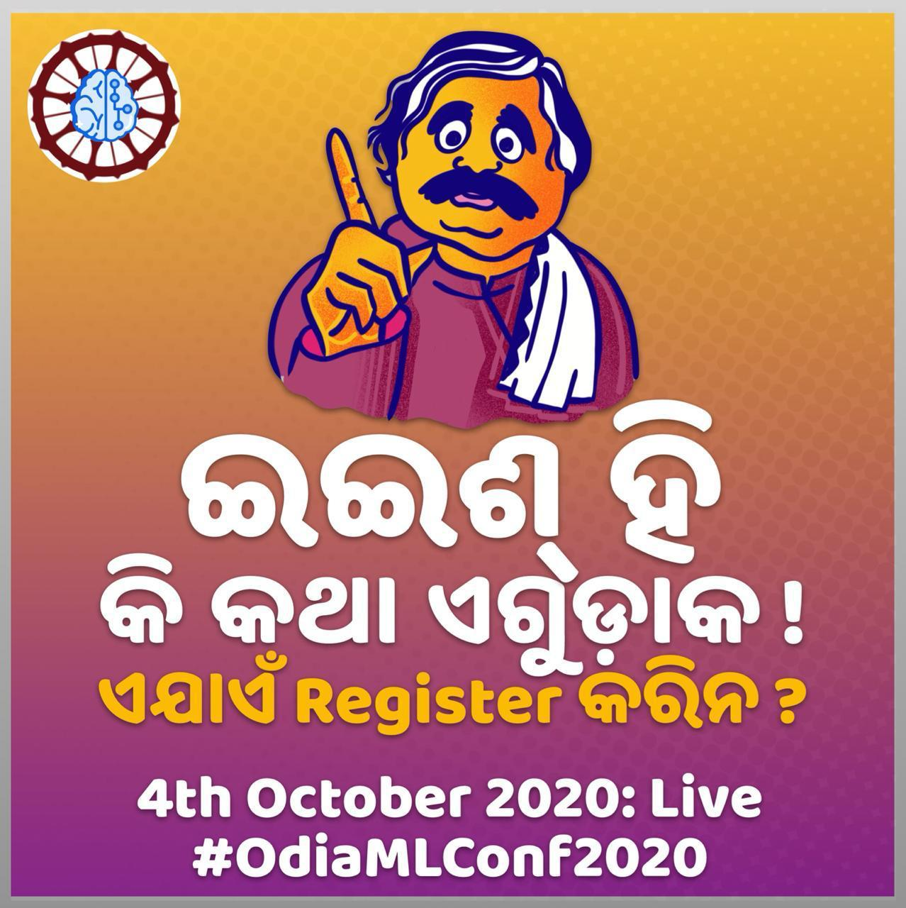
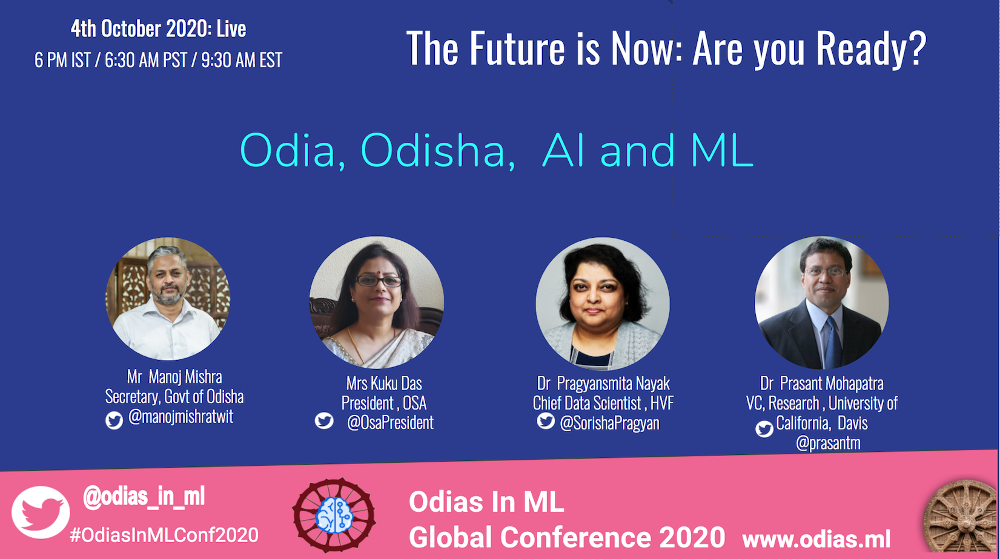
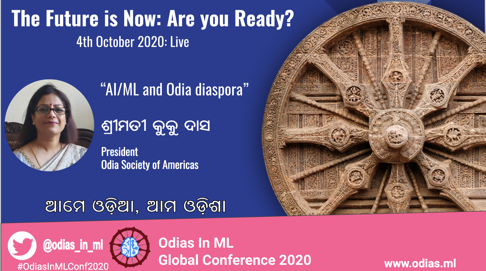
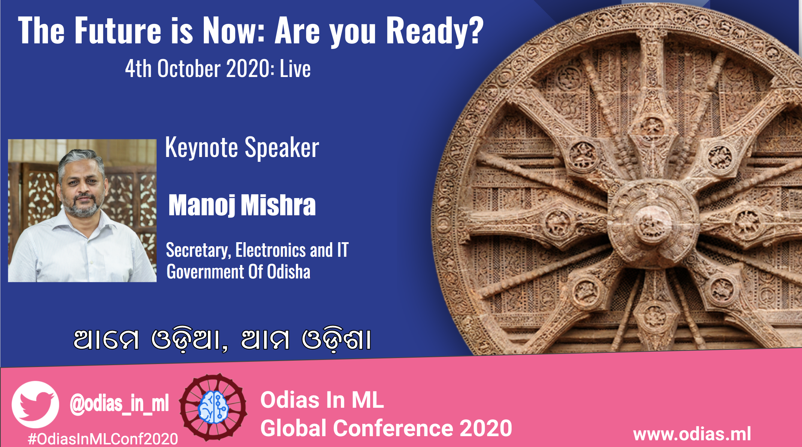
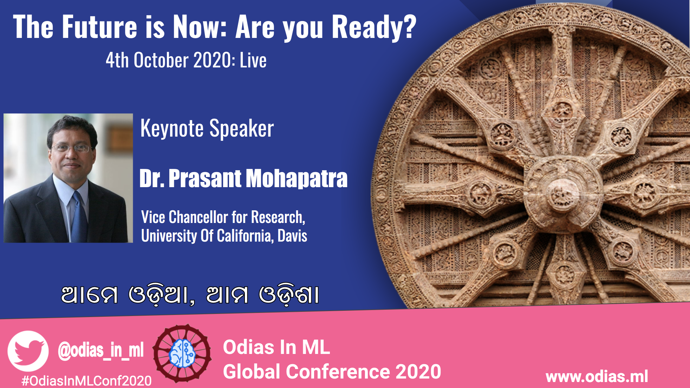
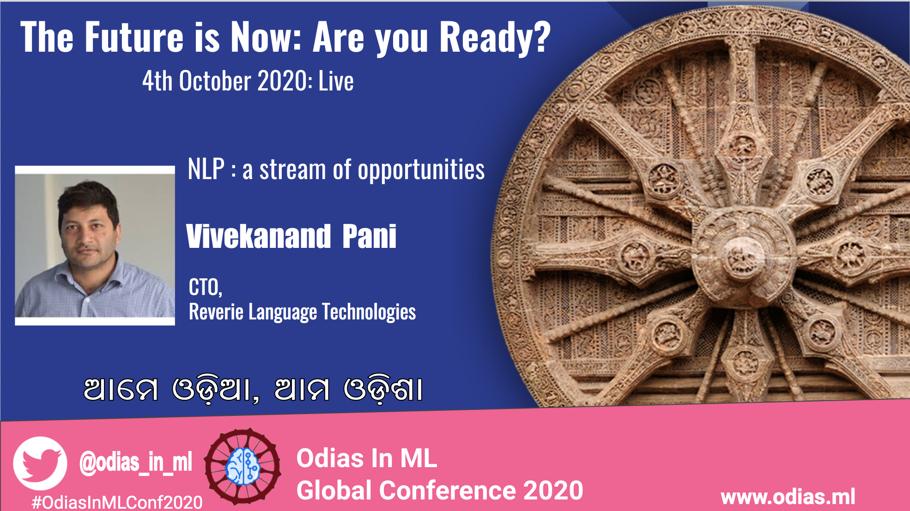

| **[Home](index)**| **[About](about)** | **[Initiatives](initiatives)** | **[Blog](blogs)** | **[Contact](contact)** |

---

**Odias in Machine Learning Conference 2020**

{:height="75%" width="75%" align="center"}

<a style="font-size: 14pt;" href="https://forms.gle/YAnBm34V41Q7vv4D9" target="_blank">Click here!</a>

Odias in ML Conference 2020 is the first international congregation of Odias techies in AI/ML, academicians, policymakers, linguists, business executives, investors, entrepreneurs and those working towards positively intervening in people’s lives through AI/ML.

The conference, divided into four sessions on the following topics, will try to set the foundation for greater engagement in the future for specific action points that will emerge from the deliberations.

In addition, a compilation of articles and videos on specialized topics withing broader subject of AI, ML and data science that are relevant for Odisha and Odia language will be published.

**Sessions**

**AI for Odisha**

How can we leverage AI/ML for overall socio-economic development of Odisha – policy and application in intervention areas; challenges and opportunities in pursuance of this goal. Speakers from areas of policymaking and applications for governance, economic development and healthcare will delve deeper into these points.

**Entrepreneurship/Business Opportunities**

Being the hottest technology application area, AI/ML has been attracting one of the largest investments across all tech areas. The session will go deeper into how Odia entrepreneurs and businesses can leverage this opportunity effectively by accessing knowledge, human resources and capital.

**Research & Career Opportunities**

Being the hottest technology area at present, AI/ML offers immense career opportunity for those wanting to pursue research in this area and those that want to build a career in technology or application involving AI/ML technologies. Speakers from academics, research and industry will guide aspiring professionals and students how to pursue this opportunity.

**Language**

Natural language processing (NLP) has been one of the most significant application of machine learning. Modern languages need to leverage the power to emerge as vibrant languages in the digital era. What are the challenges, what have been the efforts and where are the opportunities? Linguists, computational linguistics experts, and practitioners will discuss the state of the art and what to expect in future.
 
**Speakers**

{:height="75%" width="75%" align="center"}

{:height="75%" width="75%" align="center"}

{:height="75%" width="75%" align="center"}

{:height="75%" width="75%" align="center"}

{:height="75%" width="75%" align="center"}

**Registration link**

<a style="font-size: 14pt;" href="https://forms.gle/YAnBm34V41Q7vv4D9" target="_blank">Click here!</a>
